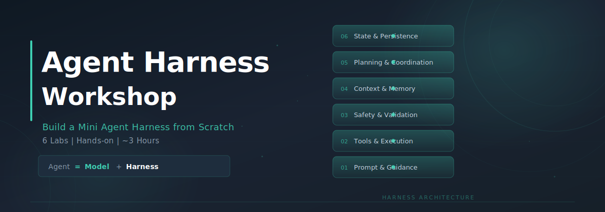

<div align="center">
  
  <br/>
  <p>
    <strong>从零搭建一个 Mini Agent Harness，用 6 个递进实验理解 Agent Harness 的工程架构。</strong>
  </p>
  <p>
    
    
    
    
  </p>
</div>

---

## 什么是 Agent Harness？

2025-2026 年，AI Agent 从实验走向生产。人们发现一个关键事实：

**Agent = Model（模型）+ Harness（驾驭层）**

模型（Claude、GPT 等）只负责「思考」和生成文本。而 **Harness 是除模型之外的所有工程基础设施**——它像套在马上的缰绳、汽车的整车系统、电脑的操作系统，把模型的智能转化成可靠、可控、可长期运行的实际工作能力。

没有 Harness 的模型，就像一个极其聪明但没有手脚、没有记忆、也不懂安全的实习生：

| 原始 LLM 的致命局限 | Harness 如何解决 |
|---------------------|-----------------|
| **无法执行操作** — 只能生成文本，不能读写文件、运行命令 | 工具执行层：把模型的意图变成真实动作 |
| **上下文窗口有限** — 长任务容易失忆或上下文污染 | 上下文压缩：自动折叠旧输出，保持窗口内 |
| **无持久状态** — 对话结束就遗忘所有工作 | 会话持久化 + 项目记忆：跨会话、跨项目保持上下文 |
| **无安全边界** — 不分辨安全与危险操作 | 权限中间件：分级拦截，Human-in-the-Loop |
| **单线程处理** — 只能串行完成任务 | 多 Agent 协调：拆分子任务，并行分治 |

> **模型决定能力上限，Harness 决定工程下限和交付能力。**

---

## Harness 的核心组件

一个完整的 Agent Harness 通常包含六层（不同框架实现略有差异，但本质一致）：

```
┌──────────────────────────────────────────────────────┐
│  ❻ 状态与持久层  工作空间 · Artifact存储 · 会话续接    │
├──────────────────────────────────────────────────────┤
│  ❺ 规划与协调层  任务分解 · 子Agent生成 · 多Agent调度  │
├──────────────────────────────────────────────────────┤
│  ❹ 验证与安全层  中间件 · 自动测试 · HITL · Guardrails │
├──────────────────────────────────────────────────────┤
│  ❸ 上下文与内存层  上下文压缩 · 持久化 · Git · 进度日志 │
├──────────────────────────────────────────────────────┤
│  ❷ 工具与执行层  工具调用拦截 · 执行 · 结果回填 · 沙箱  │
├──────────────────────────────────────────────────────┤
│  ❶ 提示与引导层  系统提示 · 初始化Prompt · 生命周期钩子 │
└──────────────────────────────────────────────────────┘
```

| 层级 | 具体内容 | 作用 |
|------|---------|------|
| **提示与引导层** | 系统提示预设、初始化 Prompt、生命周期钩子 (Hooks) | 让模型启动时就知道规则、目标和行为规范 |
| **工具与执行层** | 工具调用拦截、执行、结果回填；Bash/Code 执行沙箱 | 把模型的「想做」变成真实的「做了」 |
| **上下文与内存层** | 上下文压缩 (Compaction)、状态持久化、虚拟文件系统、Git 版本控制、进度日志 | 跨会话记忆、防止上下文爆炸 |
| **验证与安全层** | 中间件 (Middleware)、自动测试、人类审批、人机循环 (HITL)、Guardrails | 保证每一步都正确、安全、可审计 |
| **规划与协调层** | 任务分解 (Planning)、子 Agent 生成与调度 | 把大任务拆成可管理的小步，支持多 Agent 协作 |
| **状态与持久层** | 工作空间、Artifact 存储、会话续接机制 | 让 Agent「下班后」还能无缝接上 |

这些组件共同构成了 Agent 的操作系统。**模型是 CPU，上下文窗口是 RAM，Harness 就是 OS + 驱动程序。**

---

## Claude Code：生产级 Harness 的典型实现

[Claude Code](https://claude.com/claude-code) 是 Anthropic 官方的 AI 编码 Agent，也是目前最接近生产级 Agent Harness 的实现之一。它没有显式叫 Harness 这个名字，但它的整个架构正是 Harness 设计的完整体现：

```
Claude Code 架构简图

QueryEngine (Agent Loop 心脏)
  │
  ├── Tool System (30+ 工具, 统一 Tool.ts 接口)
  │     ├── FileReadTool, FileEditTool, FileWriteTool
  │     ├── BashTool (+ bashClassifier 安全分类)
  │     ├── GlobTool, GrepTool, LSPTool
  │     ├── AgentTool (子 agent 生成)
  │     ├── WebSearchTool, WebFetchTool
  │     └── MCPTool (标准化外部工具协议)
  │
  ├── Permission System (4 种模式)
  │     ├── default — 危险操作需确认
  │     ├── plan — 只读规划，确认后执行
  │     ├── auto — 分类器自动判断
  │     └── bypassPermissions — 全放行(仅调试)
  │
  ├── Memory & Context
  │     ├── apiMicrocompact — 上下文微压缩
  │     ├── memdir/ — 项目记忆 (CLAUDE.md 发现)
  │     └── Session persistence — /resume 会话恢复
  │
  └── Multi-Agent Coordination
        ├── TeamCreateTool — 创建 agent 团队
        ├── TaskCreate/List/Update — 任务管理
        └── SendMessageTool — agent 间通信
```

| Harness 能力 | Claude Code 实现 | 解决的痛点 |
|-------------|-----------------|-----------|
| 持久状态 | Memdir + Session JSON | 会话结束就遗忘 |
| 上下文管理 | Micro-compaction + CLAUDE.md | 上下文爆炸 |
| 工具可靠执行 | Tool 接口 + Hooks + 沙箱 | 无法安全执行真实操作 |
| 验证闭环 | Permission System + Plan 模式 | 容易漂移、幻觉 |
| 长时任务协调 | Agent Loop + Multi-Agent Swarm | 任务半途而废 |
| 可恢复性 | Git Worktree + Rewind + Resume | 失败后无法继续 |

---

## Workshop 设计

### 核心理念：痛点驱动的递进建造 — 6 Lab 对齐 6 层架构

不是讲理论，而是让你**亲手从零搭建一个 Mini Harness**。6 个 Lab 分别对应 Harness 六层核心组件，每个 Lab 暴露一个真实痛点，然后用一层 Harness 解决它：

```
Lab 1: ❶ 提示与引导层  → 痛点「裸 LLM 无规则，行为混乱」
  ↓ 有了引导，但说了做不了
Lab 2: ❷ 工具与执行层  → 痛点「能做了，但不安全」
  ↓
Lab 3: ❸ 验证与安全层  → 痛点「安全了，但长对话爆 token」
  ↓
Lab 4: ❹ 上下文与内存层 → 痛点「记忆管好了，但复杂任务忙不过来」
  ↓
Lab 5: ❺ 规划与协调层  → 痛点「能协作了，但关掉就丢失一切」
  ↓
Lab 6: ❻ 状态与持久层  → 完整 Mini Harness ✅
```

### 六个实验模块

| Lab | Harness 层级 | 你将实现 | 对应 Claude Code 源码 | 时间 |
|-----|-------------|---------|---------------------|------|
| **1** | ❶ 提示与引导层 | System prompt 工程 + CLAUDE.md + Hooks | `QueryEngine.ts`, `memdir/`, hooks | 30min |
| **2** | ❷ 工具与执行层 | 统一 Tool 接口 + 3 个工具 + 执行管道 | `Tool.ts`, `BashTool/` | 35min |
| **3** | ❸ 验证与安全层 | 权限中间件 + Bash 分类器 + HITL | `permissions/`, bashClassifier | 30min |
| **4** | ❹ 上下文与内存层 | Micro-compaction + 项目记忆 | `apiMicrocompact.ts`, `memdir/` | 25min |
| **5** | ❺ 规划与协调层 | AgentTool + 任务管理 | `AgentTool/`, `TaskCreateTool/` | 25min |
| **6** | ❻ 状态与持久层 | Session 持久化 + Resume + Rewind | session persistence, `/resume` | 20min |

### 每个 Lab 的结构

1. **痛点演示** (5min) — 运行上一个 Lab 的代码，碰到天花板
2. **源码对照** (5min) — 对照 Claude Code 中的真实设计
3. **动手编码** (20-30min) — 用 Python 写这一层的简化实现
4. **验证运行** (5min) — 运行增强后的 agent，确认问题解决

---

## 快速开始

### 环境要求

- Python 3.11+
- OpenAI API Key
- Jupyter Notebook

### 安装

```bash
cd labs/
pip install -r requirements.txt   # openai + jupyter

# 配置 OpenAI API Key
export OPENAI_API_KEY="your-openai-api-key"

# 可选：指定模型（默认 gpt-5.4）
export OPENAI_MODEL="gpt-5.4"
```

### 运行

```bash
cd labs/
jupyter notebook
```

按顺序打开 `lab1_prompt_guidance.ipynb` → `lab2_tool_execution.ipynb` → ... → `lab6_state_persistence.ipynb`。

每个 notebook 自包含完整的中文说明和可运行代码，按顺序执行 cell 即可。

---

## 项目结构

```
agent_harness/
├── README.md                        ← 你正在看的文件
├── labs/                            ← 动手实验 notebook
│   ├── lab1_prompt_guidance.ipynb       Lab 1: ❶ 提示与引导层
│   ├── lab2_tool_execution.ipynb        Lab 2: ❷ 工具与执行层
│   ├── lab3_safety_permission.ipynb      Lab 3: ❸ 验证与安全层
│   ├── lab4_context_memory.ipynb         Lab 4: ❹ 上下文与内存层
│   ├── lab5_planning_coordination.ipynb Lab 5: ❺ 规划与协调层
│   ├── lab6_state_persistence.ipynb     Lab 6: ❻ 状态与持久层
│   ├── CLAUDE.md                        Lab 1/3 用的示例项目记忆
│   └── requirements.txt
├── references/                      ← 参考文档
│   ├── agent_harness_intro.md       Agent Harness 概念介绍
│   └── claude_code.md               Claude Code 架构解析
├── presentation.html                ← 配套幻灯片（16页）
├── slides/                          ← 幻灯片图片导出
├── claude-code-sourcemap/           ← Claude Code v2.1.88 源码映射
│   └── restored-src/src/            4,756 个还原的 TypeScript 文件
└── docs/plans/                      ← Workshop 设计文档
```

---

## 核心概念速查

### Agent Loop（循环层）

Agent 的本质是一个 **observe-think-act** 循环：

```
用户输入 → 调用 LLM API (带 tools 定义)
  → 模型返回 tool_use（意图）
  → Harness 执行工具（行动）
  → 将 tool_result 送回 API
  → 模型根据结果继续思考
  → 循环直到任务完成
```

### 统一工具接口（Tool Pattern）

所有工具实现同一个接口，新增工具不需要改 Agent Loop：

```python
class Tool:
    name: str           # 工具名（API 匹配用）
    description: str    # 描述（让模型理解何时用）
    input_schema: dict  # JSON Schema（参数定义）
    
    validate(input)     # 输入校验
    execute(input)      # 真正执行
```

### 权限中间件（Permission Middleware）

在工具执行前插入安全拦截层：

```
tool_use → 查找工具 → 校验输入 → 🔒 权限检查 → 执行
                                    │
                              allow → 放行
                              deny  → 拒绝
                              ask   → 暂停等用户确认 (HITL)
```

### 三层记忆架构

| 层级 | 机制 | 时间尺度 |
|------|------|---------|
| Micro-compaction | 压缩旧的工具输出 | 当前对话内 |
| Session persistence | 保存/恢复对话历史 | 跨会话 |
| Project memory (CLAUDE.md) | 项目级知识自动注入 | 跨项目 |

### Team Lead 多 Agent 模式

```
主 Agent (Team Lead)
  ├── 拆分任务 (create_task)
  ├── 派遣子 Agent (dispatch_agent)  ← 独立 context
  ├── 跟踪进度 (list_tasks)
  └── 汇总结果

子 Agent
  ├── 只有基础工具（不能再分身）
  ├── 独立的 messages 历史
  └── 有限轮数（防失控）
```

---

## Harness 与相关概念的区别

| 概念 | 定位 | 类比 |
|------|------|------|
| **Agent Framework** (LangChain, LlamaIndex) | 构建块和组件库 | 乐高积木 |
| **Agent SDK** (Anthropic SDK, OpenAI SDK) | 底层 API 工具包 | 螺丝刀和扳手 |
| **Agent Harness** (Claude Code, DeepAgents) | 已组装好的运行时系统 | 完整的、带遥控的机器人 |

Framework 给你零件，SDK 给你工具，**Harness 给你一个能直接跑的系统**。

---

## 延伸阅读

- [Claude Code 源码映射分析](https://deepwiki.com/ChinaSiro/claude-code-sourcemap/2-core-architecture) — Claude Code 架构深度解读
- [Anthropic: Building Effective Agents](https://docs.anthropic.com/en/docs/build-with-claude/prompt-engineering/agent-guidelines) — Anthropic 官方 Agent 构建指南
- [Agent Harness Engineering](references/agent_harness_intro.md) — 本项目的概念参考文档
- [Claude Code Harness 解析](references/claude_code.md) — Claude Code 源码级分析

---

## 致谢

本 Workshop 基于对 Claude Code v2.1.88 源码映射的分析设计，用于教学目的。

> **模型决定能力上限，Harness 决定工程下限和交付能力。**
>
> 同一个 Claude 模型，配上不同的 Harness，能力天差地别。理解 Harness 设计，是构建可靠 AI Agent 系统的关键。
